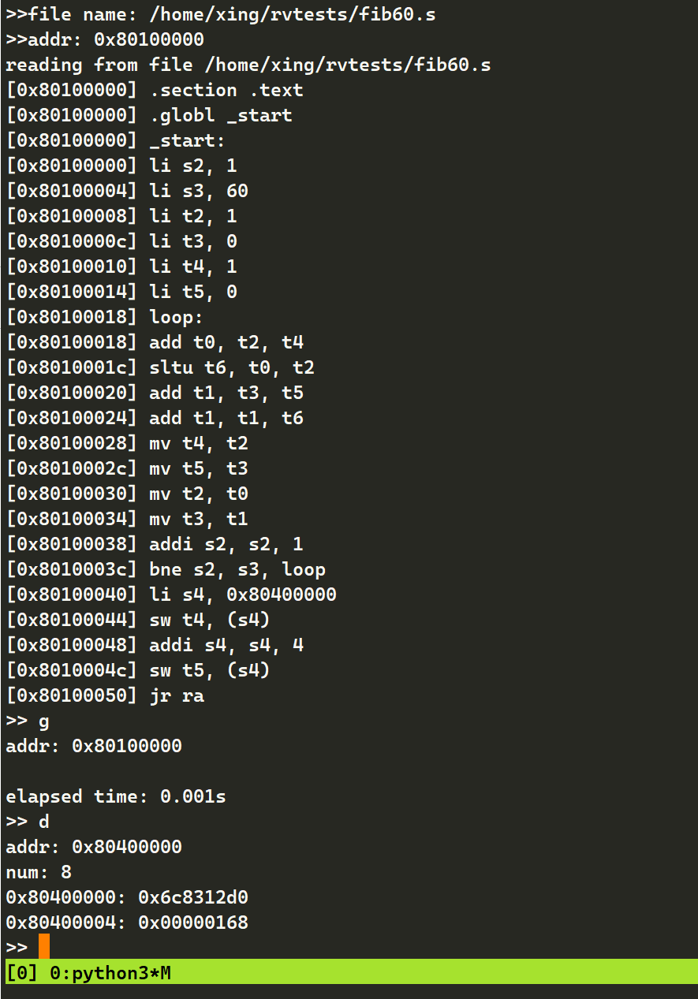

# 实验一：汇编语言与监控程序 实验报告

<center>(邢竞择 2020012890)</center>

## 上机操作

代码中使用的伪指令如下：

+ `li`，被编译为`lui`与`addi`
+ `jr`，被翻译成`jalr`

本质上均在 19 条基本指令中。在实验中，依次使用`F`,`D`指令从源文件中读取汇编语句并执行，接着使用`D`指令查看内存上的数据。以下为汇编代码以及命令行截图。

### `Fib`数列的前 10 项

```assembly
.section .text
.globl _start
_start:
        li t0,1
        li t1,1
        li t2,0
        li t3,0x80400000
        li t5,10
loop:
        sw t0,(t3)
        add t4,t0,t1
        mv t0,t1
        mv t1,t4
        addi t2,t2,1
        addi t3,t3,4
        bne t2,t5,loop
        jr ra
```


### ASCII 可见字符（0x21~0x7E）输出

```assembly
        .text
        .globl _start
WRITE_SERIAL:
        li t0, 0x10000000
.TESTW:
        lb t1, 5(t0)
        andi t1, t1, 0x20
        beq t1, zero, .TESTW
.WSERIAL:
        sb a0, 0(t0)
        jr ra
_start:
        li t2, 0x20
        li t3, 0x7e
        mv t4, ra
loop:
        addi t2, t2, 1
        mv a0, t2
        jal ra, WRITE_SERIAL
        bne t2, t3, loop
        mv ra, t4
        jr ra

```


### 斐波那契数列的第 60 项

```assembly
        .section .text
        .globl _start
_start:
        li s2, 1
        li s3, 60
        li t2, 1
        li t3, 0
        li t4, 1
        li t5, 0
loop:
        add t0, t2, t4
        sltu t6, t0, t2
        add t1, t3, t5
        add t1, t1, t6
        mv t4, t2
        mv t5, t3
        mv t2, t0
        mv t3, t1
        addi s2, s2, 1
        bne s2, s3, loop
        li s4, 0x80400000
        sw t4, (s4)
        addi s4, s4, 4
        sw t5, (s4)
        jr ra
```



## 思考题目

### `RISC-V`与`x86`寻址方式异同

`x86`和`RISC-V`都支持：

+ 立即数寻址：地址为常量
+ 寄存器寻址：地址为寄存器值
+ 基址寻址：地址为寄存器和常数之和
+ PC 相对寻址：地址是`$pc`和指令中常量之和

仅`x86`支持：

+ 基址+偏移寻址：

  例如`imm(r1,r2,s)`表示到`r1+r2*s+imm`这个地址上寻址

​	此外，`x86`的`lea`指令能够仅计算地址而不寻址，这使得`x86`在简单加法乘法上可能比`RISC-V`指令更短。

### 19 条指令

ADD, ADDI, AND, ANDI, AUIPC, BEQ, BNE, JAL, JALR, LB, LUI, LW, OR, ORI, SB, SLLI, SRLI, SW, XOR

我将其进行如下分类：
+ 运算指令：ADD, ADDI, AND, ANDI, OR, ORI, XOR, SLLI, SRLI (ADDIW)
+ 逻辑运算指令：BEQ, BNE
+ 跳转指令：JAL, JALR
+ 访存指令：LB, SB, LW, SW (LD, SD)
+ PC相关指令：AUIPC
+ 高位立即数加载指令：LUI

### `term`如何实现用户程序计时

`kernel`涉及用户程序运行的代码在`shell.S`的第 165 行`.OP_G`处。程序开始时，`kernel`代码

```assembly
        li a0, SIG_TIMERSET
        jal WRITE_SERIAL
```

向串口写入`SIG_TIMERSET`标记，以通知`term`用户程序开始，随后设置时钟、载入用户的寄存器数值，并跳转到`s10`指向的用户程序。而`term`则使从`tcp`套接字（由 QEMU 提供）接受消息，在`term.py`的第 356 行处

```python
        ret = inp.read(1)
        if ret == b'\x80':
            trap()
        if ret != b'\x06':
            print("start mark should be 0x06")
        time_start = timer()
```

先从端口`read`一个字节，由于`read`是阻塞的，所以`read`返回时即可立刻开始计时。开始计时后，`term`不断尝试从串口读取`kernel`发送的用户程序输出，并输出到屏幕上。如果在此过程中收到了约定的程序结束标记，则终止计时。

```python
            ret = inp.read(1)
            if ret == b'\x07':
                break
```

终止信号由`kernel`在第 341 行处发出。

```assembly
        li a0, SIG_TIMETOKEN
        jal WRITE_SERIAL
```

### `kernel`如何使用串口

在`serial.h`中包含了串口地址`COM1`的宏
```c++
// QEMU 虚拟的 RISC-V 机器的串口基地址在 0x10000000
// 如果使用了 AXI Uart16550，请设置为它的基地址 + 0x10000
#define COM1 0x10000000
```
仅以 QEMU 为例，以下为`utils.S`中包含的串口读写的函数。
```assembly
WRITE_SERIAL:                       // 写串口：将a0的低八位写入串口
    li t0, COM1
.TESTW:
    lb t1, %lo(COM_LSR_OFFSET)(t0)  // 查看串口状态
    andi t1, t1, COM_LSR_THRE       // 截取写状态位
    bne t1, zero, .WSERIAL          // 状态位非零可写进入写
    j .TESTW                        // 检测验证，忙等待
.WSERIAL:
    sb a0, %lo(COM_THR_OFFSET)(t0)  // 写入寄存器a0中的值
    jr ra
```
串口被抽象为一个内存地址，写串口时，内核通过不断检查状态位来等待串口空闲，在串口空闲时向其写入待发送的字节。
```assembly
READ_SERIAL:                      // 读串口：将读到的数据写入a0低八位
    li t0, COM1
.TESTR:
    lb t1, %lo(COM_LSR_OFFSET)(t0)
    andi t1, t1, COM_LSR_DR       // 截取读状态位
    bne t1, zero, .RSERIAL        // 状态位非零可读进入读
    j .TESTR                      // 检测验证
.RSERIAL:
    lb a0, %lo(COM_RBR_OFFSET)(t0)
    jr ra
```
读串口时，内核通过不断检查状态位来等待串口准备好下一个字节，在串口就绪时读入一个字节。

### `term`如何检查`kernel`已经正确连入

在`term.py:LINE 449`，`term`向串口写入错误指令`W`。

```python
    outp.write(b'W')
```

在`shell.S:LINE 37`，`kernel`对于错误指令，依照约定向串口写入`XLEN`。

```assembly
        // 错误的操作符，输出 XLEN，用于区分 RV32 和 RV64
        li a0, XLEN
        // 把 XLEN 写给 term
        jal WRITE_SERIAL
        j .DONE
```

`term`读取`kernel`的回应值，用于判断`kernel`状态是否正常，以及将`xlen`数值输出到屏幕。

```python
        xlen = ord(inp.read(1))
```