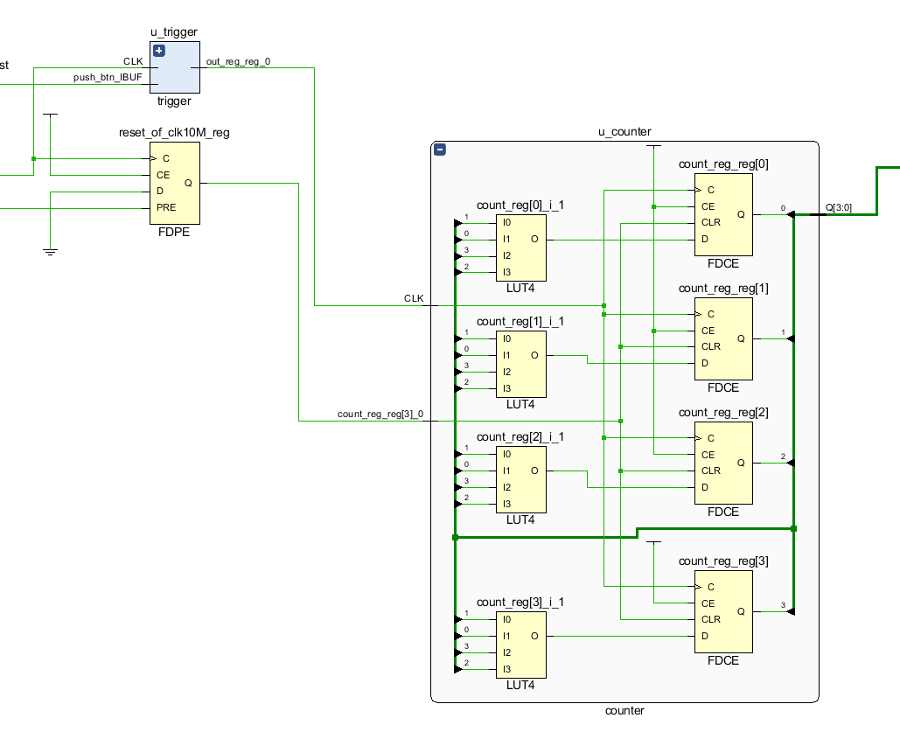
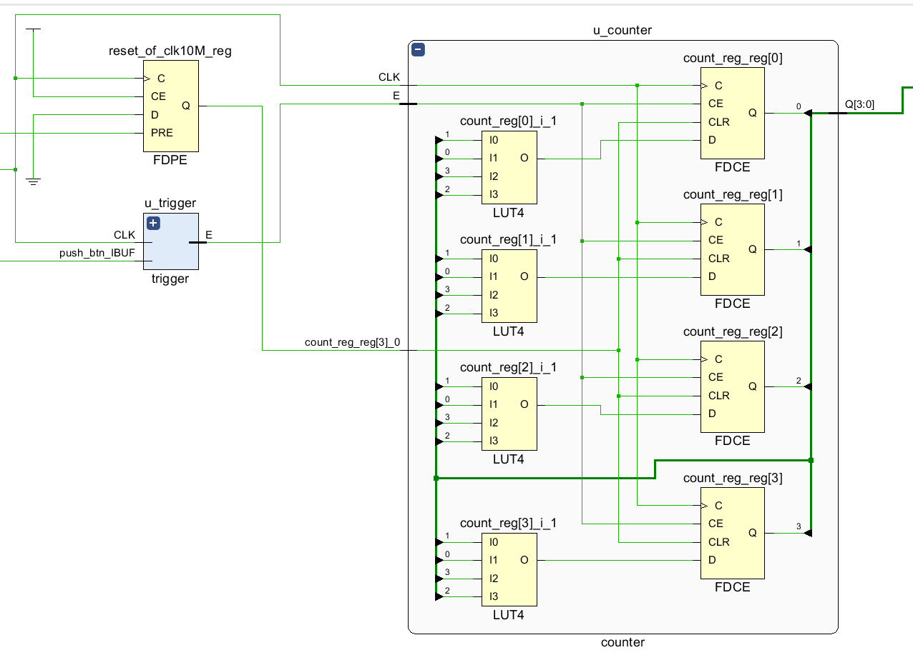

# 实验二：计数器实验 实验报告

(邢竞择 2020012890)

## 思考题目

对于计数器模块的两种不同的逻辑，分别进行综合并使用 Schematic 中得到电路图. 

### 异步逻辑

### 同步逻辑

### 分析

​      Counter 元件总体可以分为左右两部分，左侧为 LUT4 查找表，右侧为 FDCE 触发器(D Flip-Flop with Clock Enable and Asynchronous Reset)。触发器的输出 `Q[3:0]`作为查找表的输出，在触发器 C 端输入上升沿时，查找表的输出作为寄存器 D 端输入来更新寄存器内部状态。

​      进一步观察两个电路的区别，发现接口的以下区别：

| 接口名称   | 同步逻辑 | 异步逻辑 |
| ---------- | -------- | -------- |
| CLK        | 10M时钟  | trigger  |
| CE(使能端) | trigger  | 上拉(1)  |

​      这反映同步逻辑在每个时钟上升沿更新寄存器数据，而异步逻辑在 trigger 的每个上升沿更新寄存器数据。同步逻辑能够保证，只要时钟频率设定得合理，在每个上升沿到来的时候，所有的寄存器的输出都处于稳定状态，避免了时序问题；而异步逻辑则不得不面对电路延时造成的潜在问题，设计难度显著增加。
