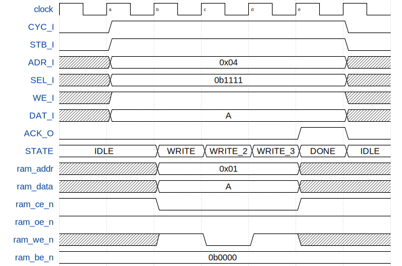

# 实验四：SRAM 控制器实验 实验报告

<center>(邢竞择 2020012890)</center>

## FSM 设计

+ `ST_IDLE`：检查 CYC 和 STB 信号，若均为 1，则进入 WRITE 或 READ 阶段，并为下一状态打开 Chip Enable，设置 SEL、SRAM 地址等

+ `ST_READ`：按照波形，需要等待一个周期才能取得数据，进入 `ST_READ_2`

+ `ST_READ_2`：为下一状态关闭 Chip Enable，将 SRAM 的返回值输出给 master，并为下一状态打开 ACK，进入 `ST_DONE`

+ `ST_WRITE`：按照如下波形图，为下一状态打开 Write Enable，进入 `ST_WRITE_2`

+ `ST_WRITE_2`：为下一状态关闭 Write Enable，打开 ACK，进入 `ST_WRITE_3`

+ `ST_WRITE_3`：为下一状态关闭 Chip Enable，进入 `ST_DONE`

+ `ST_DONE`：这一状态中 ACK 保持打开，为下一阶段关闭 ACK ，接下来进入`ST_IDLE`；  
  将`inout wire[31:0] sram_data`设为高阻态（修改立即生效）



## 思考题
1. 静态存储器的读和写各有什么特点？
   
> 读：SRAM 将数据从行中读取出来并返回，需要一个周期。
> 
> 写：SRAM 先读取地址上的数据，然后据 SEL 进行更新，最后写入到地址上，以上步骤每个耗费一个周期，总计三个周期；我们在中间的周期打开 Write Enable，这样最后一个周期时 SRAM 就能收到这个信号。

2. 什么是 RAM 芯片输出的高阻态？它的作用是什么？
   
> RAM 传输数据的端口是三态门，当一端的元件输出高阻态时，该元件就从三态门上读取（另一端的元件传输的）数据，从而实现了控制器和 RAM 间数据相互传输。由于 RAM 同一时间只能执行读或者写中的一个操作，所以这一设计避免了冗余端口的引入。

3. 本实验完成的是将 BaseRAM 和 ExtRAM 作为独立的存储器单独进行访问的功能。如果希望将 Base_RAM 和 Ext_RAM 作为一个统一的 64 位数据的存储器进行访问，该如何进行？
>设计一个 mux 模块，根据输入地址来决定对哪一个 slave 进行操作，用这一方法还能将其他外设抽象成储存器，让 CPU 能用与储存器相同的方式进行操作。

## 关键信息

`always_comb`块中，`reg <= Expr`等价于

```systemverilog
wire reg_next;
assign reg_next = Expr;
always_ff @(posedge clk) begin
  reg <= reg_next;
end
```
到达一个新的时钟周期时，发生如下事件
1. 使用上一周期计算的`reg_next`，在上升沿后皮秒级的时间内更新`reg`
2. 直到下一上升沿为止，`reg`中数据不再更新
4. 在整个周期内，持续更新所有的组合逻辑，以及诸`reg`对应的`reg_next`（这部分也是组合逻辑）。`Expr`中涉及的`logic`，若是`reg`，则由于是组合逻辑，所以最终取用的是上升沿跳变后的数据；若是内部`wire`，则必由其他`comb`或`assign`更新；若是作为 input 的`wire`，则持续取对应模块在当前周期内的输出值
