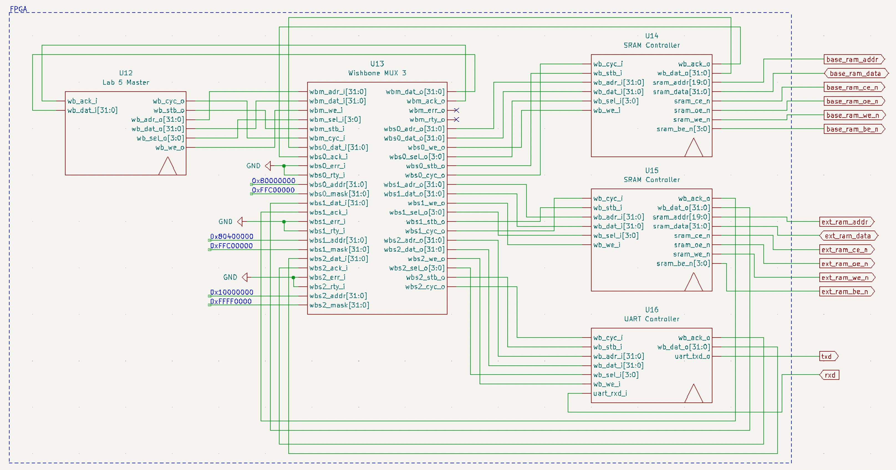

# 实验五：内存串口实验 实验报告

<center>(邢竞择 2020012890)</center>

## FSM 设计
+ `READ_WAIT_ACTION`：等待 slave 读取 uart 状态字节，收到 ack 后存储 slave 返回的数据，转移到 `READ_WAIT_CHECK`
+ `READ_WAIT_CHECK`：检查状态字节，若可读，进入`READ_DATA_ACTION`，否则返回上一状态
+ `READ_DATA_ACTION`：等待 slave 读取 uart 数据，收到 ack 后存储 slave 返回的数据，并进入`READ_DATA_DONE`
+ `READ_DATA_DONE`：读取完毕
+ `WRITE_SRAM_ACTION`：等待 sram 写入完毕，收到 ack 后进入下一状态
+ `WRITE_SRAM_DONE`：sram 写入完毕
+ `WRITE_WAIT_ACTION`：等待 slave 读取 uart 状态字节，收到 ack 后存储 slave 返回的数据，转移到 `WRITE_WAIT_CHECK`
+ `WRITE_WAIT_CHECK`：检查状态字节，若可写，进入下一状态，否则返回上一状态
+ `WRITE_DATA_ACTION`：等待 slave 写入 uart 数据，收到 ack 后进入`WRITE_DATA_DONE`
+ `WRITE_DATA_DONE`：写入结束，返回第一个状态，接受下一字节

## 设计细节

+ 在所有的 CHECK 阶段，都需要关闭 CYC 和 STB。
+ 每当读操作收到 wishbone 的 ack 信号，都需要捕获此时 wishbone 返回的数据，存储在本模块的寄存器中
```systemverilog
  always_ff @(posedge clk_i) begin
    if (rst_i) begin
      state <= READ_WAIT_ACTION;
      preset_addr <= {dip_sw[31:2], 2'b00};
    end
    else begin
      state <= nxt_state;
      if (wb_ack_i) begin
        wb_tmp <= wb_dat_i;
        if (state == READ_DATA_ACTION)
          uart_dat[7:0] <= wb_dat_i[7:0];
      end
      if (nxt_state == WRITE_SRAM_DONE)
        preset_addr <= preset_addr + 4;
    end
  end
```


