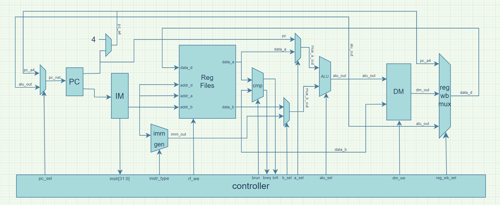
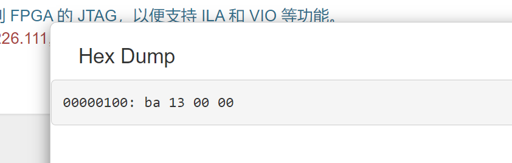

# 实验六：简单处理器实验 实验报告

## 数据通路

由于个人时间安排问题，选择了实现多周期 CPU。

### 信号说明

+ `instr_type`指令类型，对应六类 RISC-V 指令格式
+ `rf_we`寄存器堆写使能信号
+ `imm_out`根据指令类型生成的立即数（符号扩展）
+ `data_a`取出的`addr_a`寄存器数据
+ `data_b`取出的`addr_b`寄存器数据
+ `data_d`将要写回到寄存器`addr_d`的数据
+ `mux_a_out`根据`sel_a`选出的 ALU `a`端数据，为`pc`或者`data_a`
+ `mux_b_out`根据`sel_b`选出的 ALU `b`端数据，为`imm_out`或者`data_b`
+ `alu_sel`ALU 操作选择信号
+ `alu_out`ALU 的输出结果
+ `dm_we`数据内存写使能信号
+ `dm_out`数据内存数据输出
+ `reg_wb_sel`写回数据选择信号
+ `pc_a4`为了实现方便，使用独立的加法器计算的`pc+4`

### 信号表与转移时序

#### ADDI & ANDI

| `state` | `wb_addr` | `wb_cyc` | `rf_we` | `addr_a` | `addr_b` | `mux_a_out` | `mux_b_out` | `alu_sel` | `dm_we` | `addr_d` | `data_d`  | `inst_t` |
| ------- | --------- | -------- | ------- | -------- | -------- | ----------- | ----------- | --------- | ------- | -------- | --------- | -------- |
| IF      | pc        | 1        | 0       | x        | x        | x           | x           | x         | 0       | x        | x         | x        |
| ID      | x         | 0        | 0       | `rs_1`   | `rs_2`   | x           | x           | x         | 0       | x        | x         | `I`      |
| EXE     | x         | 0        | 0       | x        | x        | `data_a`    | `imm_out`   | +/&       | 0       | x        | x         | x        |
| WB      | x         | 0        | 1       | x        | x        | x           | x           | x         | 0       | `rd`     | `alu_out` | x        |

| `state` | `nxt_state` | `condition` | `operation`                           |
| ------- | ----------- | ----------- | ------------------------------------- |
| IF      | IF          | `ack==0`    |                                       |
| IF      | ID          | `ack==1`    | `instr<=wb_data_i, pc_a4<=pc+4`       |
| ID      | EXE         | 1           | `mux_a_out<=pc`, `mux_b_out<=imm_out` |
| EXE     | WB          | 1           | `data_d<=alu_out`                     |
| WB      | IF          | 1           | `pc<=pc_nxt`                          |

#### LUI

| `state` | `wb_addr` | `wb_cyc` | `rf_we` | `addr_a` | `addr_b` | `mux_a_out` | `mux_b_out` | `alu_sel` | `dm_we` | `addr_d` | `data_d`  | `inst_t` |
| ------- | --------- | -------- | ------- | -------- | -------- | ----------- | ----------- | --------- | ------- | -------- | --------- | -------- |
| IF      | pc        | 1        | 0       | x        | x        | x           | x           | x         | 0       | x        | x         | x        |
| ID      | x         | 0        | 0       | `5'h00`  | `rs_2`   | x           | x           | x         | 0       | x        | x         | `U`      |
| EXE     | x         | 0        | 0       | x        | x        | `data_a`    | `imm_out`   | +         | 0       | x        | x         | x        |
| WB      | x         | 0        | 1       | x        | x        | x           | x           | x         | 0       | `rd`     | `alu_out` | x        |

| `state` | `nxt_state` | `condition` | `operation`                               |
| ------- | ----------- | ----------- | ----------------------------------------- |
| IF      | IF          | `ack==0`    |                                           |
| IF      | ID          | `ack==1`    | `instr<=wb_data_i, pc_a4<=pc+4`           |
| ID      | EXE         | 1           | `mux_a_out<=data_a`, `mux_b_out<=imm_out` |
| EXE     | WB          | 1           | `data_d<=alu_out`                         |
| WB      | IF          | 1           | `pc<=pc_nxt`                              |

#### ADD

| `state` | `wb_addr` | `wb_cyc` | `rf_we` | `addr_a` | `addr_b` | `mux_a_out` | `mux_b_out` | `alu_sel` | `dm_we` | `addr_d` | `data_d`  | `inst_t` |
| ------- | --------- | -------- | ------- | -------- | -------- | ----------- | ----------- | --------- | ------- | -------- | --------- | -------- |
| IF      | pc        | 1        | 0       | x        | x        | x           | x           | x         | 0       | x        | x         | x        |
| ID      | x         | 0        | 0       | `rs_1`   | `rs_2`   | x           | x           | x         | 0       | x        | x         | `R`      |
| EXE     | x         | 0        | 0       | x        | x        | `data_a`    | `data_b`    | +         | 0       | x        | x         | x        |
| WB      | x         | 0        | 1       | x        | x        | x           | x           | x         | 0       | `rd`     | `alu_out` | x        |

| `state` | `nxt_state` | `condition` | `operation`                              |
| ------- | ----------- | ----------- | ---------------------------------------- |
| IF      | IF          | `ack==0`    |                                          |
| IF      | ID          | `ack==1`    | `instr<=wb_data_i, pc_a4<=pc+4`          |
| ID      | EXE         | 1           | `mux_a_out<=data_a`, `mux_b_out<=data_b` |
| EXE     | WB          | 1           | `data_d<=alu_out`                        |
| WB      | IF          | 1           | `pc<=pc_nxt`                             |

#### LB

| `state` | `wb_addr` | `wb_data` | `wb_cyc` | `rf_we` | `addr_a` | `addr_b` | `mux_a_out` | `mux_b_out` | `alu_sel` | `dm_we` | `addr_d` | `data_d` | `inst_t` |
| ------- | --------- | --------- | -------- | ------- | -------- | -------- | ----------- | ----------- | --------- | ------- | -------- | -------- | -------- |
| IF      | pc        | x         | 1        | 0       | x        | x        | x           | x           | x         | 0       | x        | x        | x        |
| ID      | x         | x         | 0        | 0       | `rs_1`   | `5'b00`  | x           | x           | x         | 0       | x        | x        | `I`      |
| EXE     | x         | x         | 0        | 0       | x        | x        | `data_a`    | `imm_out`   | +         | 0       | x        | x        | x        |
| MEM     | `alu_out` | x         | 1        | 0       | x        | x        | x           | x           | x         | 0       | x        | x        | x        |
| WB      | x         | x         | 0        | 1       | x        | x        | x           | x           | x         | 0       | `rd`     | `dm_out` | x        |

| `state` | `nxt_state` | `condition` | `operation`                              |
| ------- | ----------- | ----------- | ---------------------------------------- |
| IF      | IF          | ack==0      |                                          |
| IF      | ID          | ack==1      | `instr<=wb_data_i, pc_a4<=pc+4`          |
| ID      | EXE         | 1           | `mux_a_out<=data_a`, `mux_b_out<=data_b` |
| EXE     | MEM         | 1           | `data_d<=alu_out`                        |
| MEM     | MEM         | ack==0      |                                          |
| MEM     | WB          | ack==1      | `data_d<=dm_out`                         |
| WB      | IF          | 1           | `pc<=pc_nxt`                             |

#### SB & SW

| `state` | `wb_addr` | `wb_data` | `wb_cyc` | `rf_we` | `addr_a` | `addr_b` | `mux_a_out` | `mux_b_out` | `alu_sel` | `dm_we` | `addr_d` | `data_d` | `inst_t` |
| ------- | --------- | --------- | -------- | ------- | -------- | -------- | ----------- | ----------- | --------- | ------- | -------- | -------- | -------- |
| IF      | pc        | x         | 1        | 0       | x        | x        | x           | x           | x         | 0       | x        | x        | x        |
| ID      | x         | x         | 0        | 0       | `rs_1`   | `rs_2`   | x           | x           | x         | 0       | x        | x        | `S`      |
| EXE     | x         | x         | 0        | 0       | x        | x        | `data_a`    | `imm_out`   | +         | 0       | x        | x        | x        |
| MEM     | `alu_out` | `data_b`  | 1        | 0       | x        | x        | x           | x           | x         | 1       | x        | x        | x        |

| `state` | `nxt_state` | `condition` | `operation`                              |
| ------- | ----------- | ----------- | ---------------------------------------- |
| IF      | IF          | `ack==0`    |                                          |
| IF      | ID          | `ack==1`    | `instr<=wb_data_i, pc_a4<=pc+4`          |
| ID      | EXE         | 1           | `mux_a_out<=data_a`, `mux_b_out<=data_b` |
| EXE     | MEM         | 1           | `data_d<=alu_out`                        |
| MEM     | MEM         | `ack==0`    |                                          |
| MEM     | IF          | `ack==1`    |                                          |

#### BEQ

| `state` | `wb_addr` | `wb_cyc` | `rf_we` | `addr_a` | `addr_b` | `mux_a_out` | `mux_b_out` | `alu_sel` | `inst_t` |
| ------- | --------- | -------- | ------- | -------- | -------- | ----------- | ----------- | --------- | -------- |
| IF      | pc        | 1        | 0       | x        | x        | x           | x           | x         | x        |
| ID      | x         | 0        | 0       | `rs_1`   | `rs_2`   | x           | x           | x         | `B`      |
| EXE     | x         | 0        | 0       | x        | x        | `pc`        | `imm`       | +         | x        |
| WB      | x         | 0        | 0       | x        | x        | x           | x           | x         | x        |

| `state` | `nxt_state` | `condition` | `operation`                              |
| ------- | ----------- | ----------- | ---------------------------------------- |
| IF      | IF          | ack==0      |                                          |
| IF      | ID          | ack==1      | `instr<=wb_data_i, pc_a4<=pc+4`          |
| ID      | EXE         | 1           | `mux_a_out<=data_a`, `mux_b_out<=data_b` |
| WB      | IF          | 1           | `pc<=breq?alu_pc_nxt`                    |

## 思考题

+ 在 ID 阶段比较：可以更早得到跳转结果，更早填入bubble，减少指令的浪费；但必然与寄存器读取串行，导致延迟增加
+ 在 EXE 阶段比较：与 ALU 同时进行，不会引入新的延迟；分支错误时，会使更多无关指令进入流水线

## 实验结果

